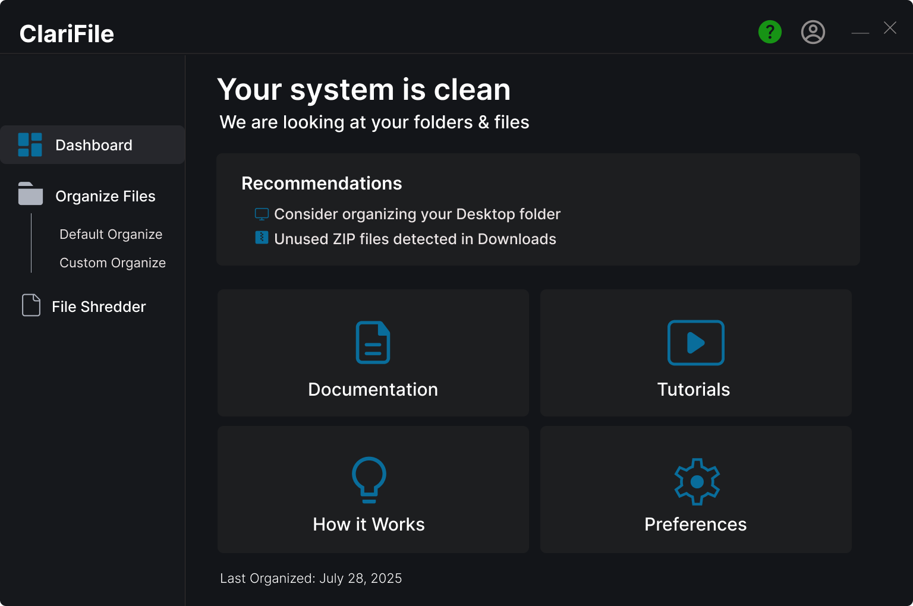

# How to Run the QML File

This project contains QML files that can be run using Qt's `qmlscene` tool or inside Qt Creator.

---

## Primary Method (Recommended)

### Run using full path to `qmlscene`

Open your terminal or command prompt in the folder where `main.qml` is located and run:

```bash
"path-to-Qt-bin-folder/qmlscene.exe" main.qml
````

> This runs your QML file directly using the Qt executable. Use this if you have not added Qt's bin folder to your system PATH.

---

## Alternative Methods

### Alternative 1: Run using `qmlscene` if added to system PATH

If you have added your Qt installation's `bin` folder to your system PATH, simply run:

```bash
qmlscene main.qml
```

No need to type the full path, because your system will find `qmlscene.exe` automatically.

---

### Alternative 2: Run using `qml` command (if available)

Some Qt installations provide the `qml` command as an alternative to `qmlscene`. You can try running:

```bash
qml main.qml
```

> Note: This command might not be available in all Qt versions; `qmlscene` is the standard and preferred tool.

---

### Alternative 3: Run inside Qt Creator IDE

1. Open **Qt Creator**.
2. Open this project folder or create a new Qt Quick project.
3. Add `main.qml` to the project (if not already added).
4. Press the **Run** button (green triangle) or press `Ctrl + R`.

Qt Creator will automatically use the right tools to run your QML file.

---

### Alternative 4: Run via a Qt Quick C++ Application

Create a minimal Qt C++ application that loads and runs your QML file. Build and run this app from Qt Creator or your build system.

---

## Notes

* Adding Qt’s `bin` directory to your system PATH simplifies running commands like `qmlscene`.
* Replace the path `"path-to-Qt-bin-folder/qmlscene.exe"` with the actual path on your system.
* Use double quotes for Windows paths containing spaces.

```
```

### GUI - Homepage

