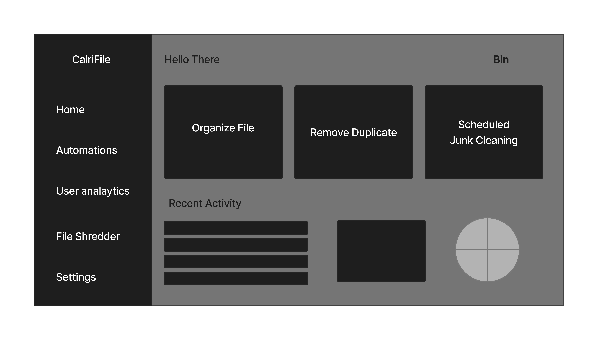

# ClariFile

### ClariFile primarily organizes files by making folders for each type of extentions,size,etc. This is also a grouop project for subject ENGG102 in Bsc Computer Science (I-II) at Kathmandu University.

We all tend to download stuffs , build stuffs and never organize our folders. This app fixes this issues , not just that you can enable auto organize option for folders such as download which is generally unorganized.

## Features
- Seperates files and keeps them in different folders (basis of file extentions .ppt .pdf etc)
- Has auto organize which you can turn it on for folders like downloads
- Cleaning junk,duplicate files from the system
- Shredding (Permanently deleting something from a drive so that it cannot be recovered)

### Tech Tack
- C++ for logic
- Qt Framework for GUI

### Demo GUI (will be replaced once app is done)

